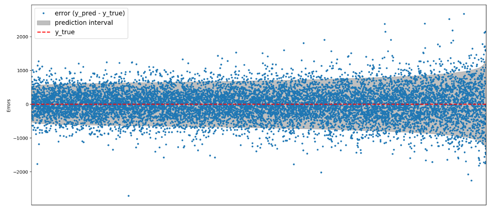
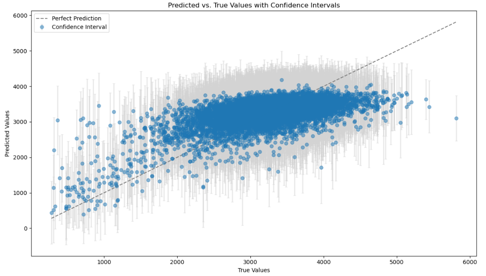

# Birth Weight Prediction Kaggle Competition


## Introduction

This repository hosts the code and analysis for the Kaggle competition 
[Prediction Interval Competition I: Birth Weight](https://www.kaggle.com/competitions/prediction-interval-competition-i-birth-weight). 
Our project focuses on developing robust prediction models for birth weight intervals, 
emphasizing uncertainty estimations which ranked 6th in leadership. 


## Motivation

A data science topic as conformal prediction algorithms, quiet new, ongoing learning with lot room of experimentation 
and research in real data problems.

## Project Structure

      project/
        ├── src/                
        │   ├── __init__.py
        │   ├── feature_engineering.py
        │   ├── labeling_encoding.py
        │   ├── labeling_encoding_group.py
        │   └── MWIS_metric.py
        ├── output/                   # Directory for outputs
        │   ├── Compare_Results.html  # sweetviz outputs
        │   ├── imputed_test1.pkl     # inputed train datasets
        │   ├── imputed_train1.pkl   # inputed train datasets
        │   ├── intervalpredictions.PNG # pic of outputs
        │   ├── intervalpredictions2.PNG  # pic of outputs
        │   ├── model.pkl
        │   ├── train_processed1.html # sweetviz outputs
        │   └── train_report.html   # sweetviz outputs
        ├── README.md               
        ├── prediction-interval-eda1-datalearning.ipynb  # EDA
        ├── predictions-interval-predictions.ipynb # model
        ├── requirements.txt         
        └── submission.csv            


## Methodology

### Feature Engineering for Enhanced Predictions

We implemented custom encoding techniques and utilized the NICE algorithm for imputing missing data, 
to improve model performance.

### Model Optimization

We chose Catboost for its robustness and leveraged Optuna for 
hyperparameter tuning with RMSEWithUncertainty on calibrated interval results 
with MWIS.

### Calibration and Uncertainty Quantification

Our calibration methodology, inspired by 
[Jef Jonkers script](https://www.kaggle.com/code/jefjai/conformalized-catboost-uncertainty-w-o-hyperopt), 
dynamically adjusted prediction intervals by normalizing absolute prediction errors against predicted uncertainty.

## Challenges

Predicting extreme birth weights remains a hurdle, used many different approaches indicating 
a gap in our dataset where certain explanatory variables might be underrepresented.

## Future Directions

Improvements could be made by introducing a dedicated feature selection process 
and further investigating the factors influencing extreme birth weight predictions that missed.

## Conclusion

Our approach results of birth weight intervals.






## Setup and Installation

```bash
# Clone the repository
git clone https://github.com/KyriakosJiannis/kaggle-interval-birth-weight

# Navigate to the project directory
cd path/to/cloned/repository

# Create a new Conda environment named 'kaggle-interval' and install Python
conda create --n kaggle-interval python=3.11

# Install the required dependencies
pip install -r requirements.txt
```

## License
Completely free and open-source and licensed under the MIT license.
